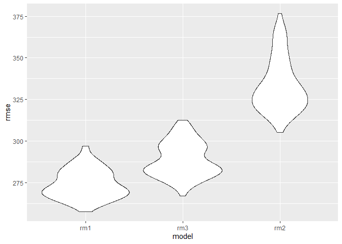

hw6\_sl4660
================
Sibei Liu
2019/11/24

# Problem 1

``` r
library(tidyverse)
library(modelr)
library(mgcv)
```

``` r
child_weight=read_csv("./data/birthweight.csv") %>% 
  drop_na() %>% 
  mutate(
 babysex=factor(babysex,levels=c(1,2),labels=c("male","female")),
 frace=factor(frace,levels=c(1,2,3,4,8,9),labels=c( "White", "Black", "Asian", "Puerto Rican","Other", "Unknown")),
 mrace=factor(mrace,levels=c(1,2,3,4,8),labels=c( "White", "Black", "Asian", "Puerto Rican","Other")),
 malform=factor(malform,levels=c(0,1),labels=c("absent","present"))
)
```

## Let’s build a model

Here is my model building process First add all variables into the
model(like backward method)

``` r
rm1=lm(bwt~.,data=child_weight)
summary(rm1)
```

    ## 
    ## Call:
    ## lm(formula = bwt ~ ., data = child_weight)
    ## 
    ## Residuals:
    ##      Min       1Q   Median       3Q      Max 
    ## -1097.68  -184.86    -3.33   173.09  2344.15 
    ## 
    ## Coefficients: (3 not defined because of singularities)
    ##                     Estimate Std. Error t value Pr(>|t|)    
    ## (Intercept)       -6265.3914   660.4011  -9.487  < 2e-16 ***
    ## babysexfemale        28.7073     8.4652   3.391 0.000702 ***
    ## bhead               130.7781     3.4523  37.881  < 2e-16 ***
    ## blength              74.9536     2.0217  37.075  < 2e-16 ***
    ## delwt                 4.1007     0.3948  10.386  < 2e-16 ***
    ## fincome               0.2898     0.1795   1.614 0.106551    
    ## fraceBlack           14.3313    46.1501   0.311 0.756168    
    ## fraceAsian           21.2361    69.2960   0.306 0.759273    
    ## fracePuerto Rican   -46.9962    44.6782  -1.052 0.292912    
    ## fraceOther            4.2969    74.0741   0.058 0.953745    
    ## gaweeks              11.5494     1.4654   7.882 4.06e-15 ***
    ## malformpresent        9.7650    70.6259   0.138 0.890039    
    ## menarche             -3.5508     2.8951  -1.226 0.220083    
    ## mheight               9.7874    10.3116   0.949 0.342588    
    ## momage                0.7593     1.2221   0.621 0.534418    
    ## mraceBlack         -151.4354    46.0453  -3.289 0.001014 ** 
    ## mraceAsian          -91.3866    71.9190  -1.271 0.203908    
    ## mracePuerto Rican   -56.4787    45.1369  -1.251 0.210901    
    ## parity               95.5411    40.4793   2.360 0.018307 *  
    ## pnumlbw                   NA         NA      NA       NA    
    ## pnumsga                   NA         NA      NA       NA    
    ## ppbmi                 4.3538    14.8913   0.292 0.770017    
    ## ppwt                 -3.4716     2.6121  -1.329 0.183913    
    ## smoken               -4.8544     0.5871  -8.269  < 2e-16 ***
    ## wtgain                    NA         NA      NA       NA    
    ## ---
    ## Signif. codes:  0 '***' 0.001 '**' 0.01 '*' 0.05 '.' 0.1 ' ' 1
    ## 
    ## Residual standard error: 272.5 on 4320 degrees of freedom
    ## Multiple R-squared:  0.7183, Adjusted R-squared:  0.717 
    ## F-statistic: 524.6 on 21 and 4320 DF,  p-value: < 2.2e-16

then remove the variable with p\_value smaller than 0.05, then the
babysex, bhead, blength,delwt,gaweeks,mrace,parity,smoken retains. Next,
re-fit the model with above fitered variables.

``` r
rm1_1=lm(bwt~babysex+bhead+blength+delwt+gaweeks+mrace+parity+smoken,data=child_weight)
summary(rm1_1)
```

    ## 
    ## Call:
    ## lm(formula = bwt ~ babysex + bhead + blength + delwt + gaweeks + 
    ##     mrace + parity + smoken, data = child_weight)
    ## 
    ## Residuals:
    ##      Min       1Q   Median       3Q      Max 
    ## -1119.67  -181.24    -5.87   173.51  2340.76 
    ## 
    ## Coefficients:
    ##                     Estimate Std. Error t value Pr(>|t|)    
    ## (Intercept)       -5822.5934    98.8325 -58.914  < 2e-16 ***
    ## babysexfemale        28.6609     8.4951   3.374 0.000748 ***
    ## bhead               131.6982     3.4607  38.056  < 2e-16 ***
    ## blength              75.8653     2.0210  37.538  < 2e-16 ***
    ## delwt                 2.2649     0.1961  11.550  < 2e-16 ***
    ## gaweeks              12.1400     1.4654   8.284  < 2e-16 ***
    ## mraceBlack         -146.7893     9.2435 -15.880  < 2e-16 ***
    ## mraceAsian          -71.5880    42.4809  -1.685 0.092026 .  
    ## mracePuerto Rican  -119.5979    18.7656  -6.373 2.04e-10 ***
    ## parity               98.6113    40.5334   2.433 0.015021 *  
    ## smoken               -4.7472     0.5882  -8.071 8.96e-16 ***
    ## ---
    ## Signif. codes:  0 '***' 0.001 '**' 0.01 '*' 0.05 '.' 0.1 ' ' 1
    ## 
    ## Residual standard error: 273.8 on 4331 degrees of freedom
    ## Multiple R-squared:  0.7148, Adjusted R-squared:  0.7142 
    ## F-statistic:  1086 on 10 and 4331 DF,  p-value: < 2.2e-16

We find all variables in this model is significant. That is what I will
use.

## The plot of model residual

``` r
add_child_weight=child_weight %>% 
  add_predictions(rm1_1) %>% 
  add_residuals (rm1_1) 

  ggplot(add_child_weight,aes(x = pred, y = resid)) + 
    geom_point(alpha = 0.3) +
  labs(
        title = " Residuals vs. Predicted Values",
        x = "Predicted Birthweight (g)",
        y = "Residuals"
      )+
 geom_hline(yintercept = 0,col = "red",linetype = "dashed")
```

<!-- -->

The residual is bouncing around the y=0 line, meaning with conatant
variance, which indicates the model is reaonable.

## Compare my model to two others:

``` r
cv_df = 
  crossv_mc(child_weight, 100)
```

``` r
cv_df2 =
  cv_df %>% 
  mutate(
    train = map(train, as_tibble),
    test = map(test, as_tibble))

cv_df3 = 
  cv_df2 %>% 
  mutate(rm1_mod  = map(train, ~lm(bwt~babysex+bhead+blength+delwt+gaweeks+mrace+parity+smoken, data = .x)),
         rm2_mod  = map(train, ~lm(bwt~blength+gaweeks, data = .x)),
         rm3_mod  = map(train, ~lm(bwt~bhead*blength*babysex, data = .x))) %>% 
  mutate(rmse_rm1 = map2_dbl(rm1_mod , test, ~rmse(model = .x, data = .y)),
         rmse_rm2 = map2_dbl(rm2_mod , test, ~rmse(model = .x, data = .y)),
         rmse_rm3 = map2_dbl(rm3_mod, test, ~rmse(model = .x, data = .y)))
```

``` r
cv_df4=cv_df3 %>% 
  select(starts_with("rmse")) %>% 
  pivot_longer(
    everything(),
    names_to = "model", 
    values_to = "rmse",
    names_prefix = "rmse_") 

  cv_df5=mutate(cv_df4,
         model = fct_reorder(model,rmse))
    ggplot(cv_df5,aes(x = model, y = rmse)) + geom_violin()
```

<!-- -->

``` r
  cv_df5 %>% 
    group_by(model) %>% 
    summarise(mean_rmse=mean(rmse))
```

    ## # A tibble: 3 x 2
    ##   model mean_rmse
    ##   <fct>     <dbl>
    ## 1 rm1        275.
    ## 2 rm3        289.
    ## 3 rm2        334.

The smaller rmse is, the better the model is. So the first model I
created using babysex, bhead,blength,delwt,gaweeks,mrace, parity,smoken
is better. We also can read the mean of rmse in each model above.

# Problem 2

``` r
weather_df = 
  rnoaa::meteo_pull_monitors(
    c("USW00094728"),
    var = c("PRCP", "TMIN", "TMAX"), 
    date_min = "2017-01-01",
    date_max = "2017-12-31") %>%
  mutate(
    name = recode(id, USW00094728 = "CentralPark_NY"),
    tmin = tmin / 10,
    tmax = tmax / 10) %>%
  select(name, id, everything())
```

``` r
boot_sample = function(df) {
  sample_frac(df,size=1, replace = TRUE)
}
```

``` r
boot_straps = 
  data_frame(
    strap_number = 1:5000,
    strap_sample = rerun(5000, boot_sample(weather_df))
  )
```

``` r
bootsrap_results=boot_straps %>% 
  mutate(
    models = map(strap_sample, ~lm(tmax~tmin,data=.x)),
    results=map(models,broom::glance)
    )%>% 
  select(-strap_sample,-models) %>% 
  unnest(results) %>% 
  select(adj.r.squared) 
```
